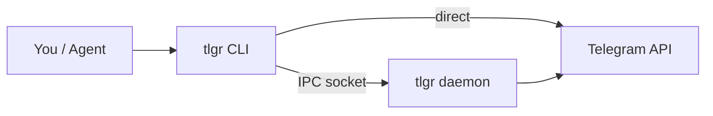
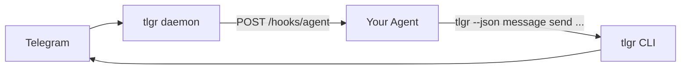
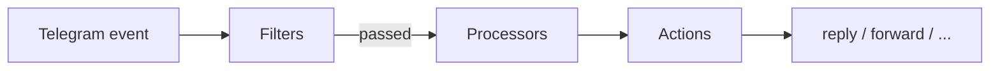

# tlgr


<!-- Created with GitHub Repo Banner by Waren Gonzaga: https://ghrb.waren.build -->

Full Telegram account control from the terminal. Agent-friendly, daemon-based, with webhook event push.

```
pip install tlgr
```

> **For agents:** logging in is a sequence of ordinary commands — `tlgr auth send-code` then `tlgr auth verify-code` — so only *reading the code* needs a person. Secrets come from `--x-env`/`--x-stdin`/`--x-file`, never argv. See [AGENT.md](AGENT.md) for the full agent reference.

## Quickstart

```bash
tlgr config init                              # create config files
tlgr login +15551234567                       # authenticate (shortcut for account add)
tlgr daemon start                             # start background daemon
tlgr send @username "Hello from tlgr"         # send a message
tlgr chats --limit 20                         # list your chats
tlgr status                                   # check daemon status
```

## CLI

Every Telegram operation available as a single command. Three output modes: human-readable tables (default), JSON (`--json`) for agents, and plain TSV (`--plain`) for piping.



### Shortcuts

Common operations are available as top-level commands for quick access:

```bash
tlgr send <chat> <text>                # message send
tlgr login <phone>                     # account add
tlgr logout <alias>                    # account remove
tlgr status                            # daemon status
tlgr chats                             # chat list
tlgr contacts                          # contact list
tlgr dl <chat> <msg_id>...            # media download
tlgr up <chat> <path>...              # media upload
```

### Messages

```bash
tlgr message send <chat> <text>        # --file, --caption, --reply-to, --silent, --parse,
                                       # --schedule, --topic, --send-as, --split
tlgr message list <chat>               # --limit, --cursor, --all, --since, --until
tlgr message get <chat> <msg_id>       # full metadata
tlgr message delete <chat> <ids...>
tlgr message search <chat> <query>     # --from, --media-type, --cursor
tlgr message pin <chat> <msg_id>       # and: message unpin
tlgr message react <chat> <id> <emoji>  # alias of `reaction add`, see Reactions
tlgr message read <chat>               # --up-to
tlgr message edit <chat> <id> <text>   # --typing N
tlgr message forward <from> <ids...> --to <chat>
tlgr message link <chat> <msg_id>      # shareable t.me link
tlgr message entity list <text>        # --parse md: what the formatting actually did
```

`message send` supports `--typing N` / `--typing-auto` to show a realistic
"typing…" indicator before the message lands. Text over 4096 UTF-16 units is
refused unless you pass `--split`.

That is the everyday tenth of the group. It also has `preview`, `compose`,
`summarize`, `translate`, `transcribe`, `report`, `thread list`, `view get`,
`read-receipt list`, `scheduled send`, `paid set`, `fact-check set`,
`dice list`, `effect list`, `game *`, `sponsored *`, `suggested *` and
`tone *` — 43 operations in all, generated from one registry, with generated
reference in [`docs/reference/message.md`](docs/reference/message.md).

`msg` is an alias for `message` (e.g. `tlgr msg send @user "hello"`).

### Polls, reactions, checklists and places

```bash
tlgr poll create <chat> "Lunch?" Pizza Sushi   # --quiz --correct N, --multiple,
                                               # --public-voters, --duration 2h
tlgr poll vote <chat> <msg_id> 0               # answers are addressed by index
tlgr poll get <chat> <msg_id>                  # results, and why you cannot vote
tlgr poll close <chat> <msg_id> --yes

tlgr reaction add <chat> <msg_id> 👍           # keeps the reactions you already had
tlgr reaction remove <chat> <msg_id>           # all of mine
tlgr reaction user list <chat> <msg_id>        # who reacted, per emoji
tlgr reaction chat set <chat> --some 👍,❤      # what this chat allows (admin)

tlgr todo create <chat> "Release" "tag it" "ship it"
tlgr todo toggle <chat> <msg_id> --done 1 --undone 2

tlgr location send <chat> -- <lat> <lon>
tlgr location live start <chat> -- <lat> <lon> --period 1h
tlgr search global "release notes"             # every chat, one cursor
```

Three things worth knowing before scripting these. A poll answer is an opaque
identifier on the wire, so tlgr resolves your index against the server's own
copy — `--shuffle` cannot make index 1 mean two answers. `sendReaction` carries
your *whole* reaction set, so `reaction add` reads what is there and resends
it rather than replacing it, and `mine` in the reply is the set afterwards. A
checklist task id is never renumbered, because completions are keyed by it.

Anything that spends Stars — `reaction pay`, `search post` past its free quota
— has no default amount and refuses to run without an explicit one.

Generated reference: [`poll`](docs/reference/poll.md),
[`reaction`](docs/reference/reaction.md), [`todo`](docs/reference/todo.md),
[`location`](docs/reference/location.md), [`search`](docs/reference/search.md).

### Drafts

Prepare a reply without sending it — you send (or discard) it later from any
Telegram client. The human-in-the-loop primitive for agents.

```bash
tlgr draft set <chat> <text>           # --reply-to, --parse
tlgr draft clear <chat>                # --all --yes to clear every draft
tlgr draft list                        # all non-empty drafts across chats
```

`draft set` returns the saved draft, and `draft list` reports marked chat ids
(`-100…` for channels) with `raw_id` beside them. See
[`docs/reference/draft.md`](docs/reference/draft.md).

### Chats

```bash
tlgr chat list                         # --folder, --type, --search, --unread, --pinned, --muted
tlgr inbox                             # shortcut: chat list (add --unread)
tlgr catchup                           # every unread chat with its recent messages, read-only
tlgr chat open <chat>                  # history AND a read receipt; --no-read to peek
tlgr chat read <chat>...               # the receipt without the history; --folder, --from-file
tlgr chat unread <chat>                # the undo for an accidental receipt
tlgr chat get <chat>                   # --full for getFullUser/getFullChat/getFullChannel
tlgr chat posters <chat>               # distinct senders + message counts, walked internally
tlgr chat archive <chat>... [--undo]   # one RPC for any number of peers
tlgr chat mute <chat> --for 8h         # or --until, --forever, --off, --stories, --folder
tlgr chat pin <chat>... [--unpin]      # --folder pins inside a chat folder; --order rewrites it
tlgr chat clear <chat> --yes           # history goes, chat stays
tlgr chat delete <chat> --yes          # --for-both, or --for-everyone if you own it
tlgr chat leave <chat>... --yes        # --delete-history, --remove-from-folders
tlgr chat typing <chat>                # --action record-audio, upload-photo, …
tlgr chat notify set <chat> --silent on
tlgr chat ttl set <chat> 1d            # auto-delete timer; omit the period to read it
tlgr chat theme set <chat> --emoji 🌷
tlgr chat wallpaper set <chat> --slug pattern
tlgr chat badge get --limits           # the unread badge, and the chat-list limits behind it
tlgr chat report <chat> --spam --yes
```

Members, admins, invites and topics:

```
tlgr chat member list <chat> --filter admins    # `chat members` still works
tlgr chat member ban <chat> @spammer --purge --report --yes
tlgr chat member restrict <chat> @noisy --deny send-media --until 7d
tlgr chat admin promote <chat> @alice --rights ban-users,delete-messages
tlgr chat permission list --mask member         # the canonical right names
tlgr chat permission set <chat> --deny send-stickers
tlgr chat invite create <chat> --limit 25 --expires 7d
tlgr chat request approve <chat> --all --yes
tlgr chat topic create <chat> Releases          # the id `--topic` takes
tlgr chat setting set <chat> --slow-mode 30s --hidden-members on
tlgr chat create <name> --type supergroup       # --members, --photo, --username
tlgr chat stats get <channel> --load-graphs
tlgr boost add <channel>
```

`chat list` returns a page of dialogs whose peer is nested under `chat`;
`chat catchup` and `chat list` never emit a read receipt, `chat open` does on
purpose, and `chat unread` restores only your own badge. A member row keeps
its participant wrapper (status, rank, promoter, both rights masks) and every
mask is allow-polarity, so `chat permission get` round-trips straight back
into `chat permission set`. Full reference:
[`docs/reference/chat.md`](docs/reference/chat.md).

### Folders

A chat folder is a filter, not a container, so every edit rewrites the whole
filter in one call — and `--folder <name|id>` works on `chat list`,
`chat read`, `chat mute`, `chat pin` and `chat badge get`.

```bash
tlgr folder list --with-counts
tlgr folder create Work --groups --emoji 💼
tlgr folder add Work @alice            # --pin to pin it inside the folder
tlgr folder remove Work @alice --exclude
tlgr folder reorder main Work Family
tlgr folder join t.me/addlist/SLUG     # previews; --chats/--all-chats to actually join
tlgr folder share set Work --all-eligible
```

Full reference: [`docs/reference/folder.md`](docs/reference/folder.md).

### Contacts

```bash
tlgr contact list                      # --with-status --sort last-seen --export vcard --out FILE
tlgr contact add <user|+phone> [name]  # --first-name --last-name --note --share-phone
tlgr contact rename <user>             # --first-name, --last-name (tags non-contacts too)
tlgr contact remove <user>...          # --phone reaches numbers with no account
tlgr contact search <query>            # --mine-only --global-only --recent
tlgr contact note set <user> <text>    # --clear
tlgr contact status list               # online / last-seen for every contact, in one call
tlgr contact birthday list
tlgr contact close-friends list|set
tlgr contact blocked list|set          # --stories for the story blocklist
tlgr contact top list|set              # frequent contacts, by category
tlgr contact import <file.vcf|csv>     # bulk phonebook import
tlgr contact sync <file>               # diff a phonebook against the server (--apply)
tlgr contact saved list                # every number ever uploaded, account or not
tlgr contact share <user> --to <chat>
tlgr contact share-phone <user>        # irreversible
```

An empty `contact add` by phone is **ambiguous** — the number may have no
account, or its owner may refuse lookups by phone — and `reason` says so
rather than the reply claiming "no such user".

### Users

```bash
tlgr user get <user>                   # --full --translate-bio LANG --from-chat/--from-message
tlgr user dialog-status <user>         # does THIS account have prior history with them?
tlgr user hide-stories <user>...       # v1's spelling of `story hide` (--unhide)
tlgr user block <user>                 # --stories --report-spam --delete-history
tlgr user unblock <user>
tlgr user can-message <user>...        # free | premium | paid (and the Stars price)
tlgr user chat list <user>             # groups you share (--leave-all)
tlgr user link <user>                  # --profile --text; `me --token` for a contact token
tlgr user photo list|set <user>
tlgr user music list <user>
tlgr user personal-channel get <user>
tlgr user birthday set <user> <date>
```

`dialog-status` distinguishes "yes", "definitively no", and "cannot tell"
(exit 13) instead of guessing. Never infer "no history" from an entity
resolution error — see AGENT.md for why.

`hide-stories` is idempotent: it reads the current flag first and reports
`already: true` without an RPC, so a bulk pass over hundreds of peers is
nearly free to repeat.

### Resolving references

```bash
tlgr resolve peer <ref>...             # @username | id | +phone | t.me link | me
tlgr resolve username <name>
tlgr resolve phone <+number>           # --offline formats and validates, no RPC
tlgr resolve link <url>                # classify any t.me / tg:// link (--open)
tlgr resolve cache get                 # inspect the per-account peer database
```

`resolve link` never *acts*: it says what a link is and names the command
that would follow it in `delegated_to`. A phone lookup that comes back empty
exits 13, never 5 — no account and a privacy refusal are indistinguishable.

### Stories

```bash
tlgr story feed list                   # the stories bar (--hidden, --unread-only)
tlgr story list <chat>                 # active; --profile, --archive, --album ID
tlgr story get <chat> <id>             # --views, --link, --areas-out, --translate
tlgr story post <file>...              # --caption, --privacy, --allow, --exclude,
                                       # --period, --pin, --album, --area-url, …
tlgr story read <chat>                 # clears YOUR ring; --register-view to be seen
tlgr story react|reply|share <chat> <id>
tlgr story pin|unpin|hide|unhide <chat> [<id>...]
tlgr story viewer list <chat> <id>     # --contacts, --q, --csv PATH
tlgr story blocklist set <user>...     # "Hide my stories from"
tlgr story album create|edit|list|delete|reorder <chat> …
tlgr story can-post | stealth set | search | stats get | export | live start | watch
```

`story read` clears your own unread ring and tells the poster nothing;
`--register-view` is what puts you in their viewer list, and it is opt-in.
`--privacy` sets the base audience and `--allow`/`--exclude` layer exceptions
on top, in that order, so "contacts, except Bob" is expressible.

### Media, stickers, GIFs and emoji

```bash
tlgr media get <chat> <msg_id>         # kind, size, duration, ids — no download
tlgr media download <chat> <msg_id>... # --out-dir, --thumb, --range, --resume,
                                       # --connections, --verify, --all, --read
tlgr media upload <chat> <path>...     # --as, --caption, --spoiler, --album,
                                       # --ttl, --no-send, --dedupe, --paid-stars
tlgr media list <chat> --type photo    # the shared-media tabs
tlgr media search <query>              # across every chat
tlgr media export <chat>               # resumable archive with a manifest
tlgr media transfer list|stop|retry    # the Downloads panel
tlgr media limit get                   # the server's own limits, never guessed

tlgr sticker set list|get|add|remove   # install / uninstall a set
tlgr sticker pack create|add|edit      # a pack you own (`emoji set …` too)
tlgr sticker fave|recent|search
tlgr gif list|add|remove|search|send
tlgr emoji get|list|search
```

A file's `file_reference` expires in hours, so every command that touches
bytes re-fetches its source first; `media file-id get --source` is how a
stored id is made usable again.
### Calls and video chats

tlgr speaks the **signalling** half of calls and carries no audio or video: it
rings, answers, hangs up, mutes, moderates, records and observes, and nobody
can hear it. Every answer says so (`"media": "none"`).

```bash
tlgr call start @alice                 # --video, --check (rings nothing), --wait
tlgr call accept <call>                # --ack-only marks it received (busy-lock)
tlgr call decline <call>               # --reason missed|busy, --reply "can't talk"
tlgr call end <call>                   # --reason, --duration
tlgr call log list                     # the Calls tab; --missed, --with @alice
tlgr call watch                        # who is ringing, as NDJSON, for a notifier
```

```bash
tlgr vc create <chat> --yes            # video chat, livestream or --rtmp
tlgr vc get <chat>                     # state, recording, limits, stream channels
tlgr vc participant list <chat>        # --raised-hands, --video
tlgr vc mute <chat> [@alice]           # --for-me; `vc unmute` = "allow to speak"
tlgr vc link <chat> --speaker          # invite links; `vc rtmp get` for the key
tlgr vc watch <chat>                   # the only way to read the in-call chat
tlgr vc download <chat> --out live.ogg # record a livestream (it cannot play one)
```

```bash
tlgr conference create                 # a t.me/call/<slug> link, no crypto needed
tlgr conference invite <call> @alice   # rings them; falls back to the link
tlgr conference decline <msg_id>       # refuse, or cancel an invite you sent
```

Conferences are end-to-end encrypted. Reading, ringing and revoking are
complete; **joining**, **removing somebody** and **sending inside** need a
signed `e2e.chain` block that tlgr cannot build — pass one with `--block` and
`--public-key`, or the command exits 2 naming what is missing.

### Profile

```bash
tlgr profile get
tlgr profile update                    # --first-name, --last-name, --bio, --photo
```

### Accounts

```bash
tlgr account add <phone>              # starts the login; prints the verify-code line to run next
tlgr account add --bot --token-env TLGR_BOT_TOKEN --alias helper
tlgr account import <file.session>    # import an existing Telethon session (no re-auth); --alias
tlgr account export <alias> --out ./work.string
tlgr account list                     # (* = default)
tlgr account switch <alias>
tlgr account logout <alias>           # revokes the authorization on the server
tlgr account remove <alias>           # local only, unless --logout
tlgr account rename <old> <new>
tlgr account info [alias]
tlgr account check [alias]            # authorized / revoked / banned / frozen / offline
tlgr account sync [alias]             # refresh stored profile from live Telegram
```

`info`, `check` and `sync` take the alias positionally, but also honor the
global `-a/--account` flag; with neither, they fall back to the active
account. Session files are stored `0600` — they are full account credentials,
and so is anything `account export` produces, which is why it writes to a
`0600` file unless `--stdout` says you meant to print it.

**`logout` is not `remove`.** `logout` revokes the authorization server-side
(v1 never did, so a removed account went on showing in every other client's
Devices list) and keeps the alias so you can log back in; `remove` deletes the
local record and says, in its answer, that the server-side session is still
alive unless you passed `--logout`.

### Logging in

```bash
tlgr auth send-code <phone> --alias work --api-id 12345 --api-hash-env TLGR_API_HASH
tlgr auth verify-code <code> --alias work --password-env TLGR_2FA_PASSWORD
tlgr auth qr --alias work             # streams tg://login tokens until one is approved
tlgr auth recover                     # forgot the cloud password (recovery email)
tlgr auth code list                   # the login code Telegram sent this account (chat 777000)
tlgr auth tos                         # read the Terms of Service; --accept is a separate run
```

The pending login lives in the daemon — which owns the session file, so two
processes never open it at once — and is mirrored to
`<account>/login-state.json` at `0600`, which is what lets the two steps run
minutes apart. `auth verify-code` exits 4 when the account has a cloud
password and none was supplied: add `--password-env` and re-run the same line.

### Sessions, passwords and connected websites

```bash
tlgr account session list [--unconfirmed] [--pending-password]
tlgr account session terminate <hash>... | --all-others [--deny]
tlgr account session confirm <hash>            # "yes, it's me"
tlgr account session set <hash> --calls off    # --secret-chats, --auto-terminate 6m
tlgr account session accept-qr 'tg://login?token=…'   # approve another device

tlgr account password get [--verify]           # 2FA status; --password-env to reveal the recovery address
tlgr account password set --new-password-env TLGR_2FA_NEW_PASSWORD --hint "…"
tlgr account password change --password-env … --new-password-env …
tlgr account password remove --password-env … --yes

tlgr account website list                      # a *different* list from Devices
tlgr account website revoke <hash>... [--block-bot]
tlgr account passkey list                      # auditable; a CLI can never create one
tlgr account ttl set 12m                       # delete my account if I am away this long
```

`account session list` derives two fields you cannot get by hand:
`deny_deadline` (after it, Telegram auto-confirms an unrecognised login for
you) and `sensitive_actions_eligible_at` (what `SESSION_TOO_FRESH_X` counts
down to). `password change` refuses when the account stores Telegram Passport
documents unless `--keep-passport` acknowledges that they will be lost — the
secure secret is encrypted under the password and tlgr does not implement the
KDF that would re-encrypt it.

### Daemon

```bash
tlgr daemon start                     # --foreground, --catch-up/--no-catch-up
tlgr daemon stop                      # drains in-flight work rather than killing it
tlgr daemon status                    # running/ready/healthy, per-account state and lag
tlgr daemon restart                   # --grace 10s
tlgr daemon reconnect                 # force a reconnect and a catch-up
tlgr daemon save-state                # flush pts/qts and the entity cache now
tlgr daemon logs --follow --level warning
tlgr daemon flood list                # rate-limit deadlines this install still owes
tlgr daemon dead-letter list          # events no consumer could be given
tlgr daemon install                   # LaunchAgent on macOS, systemd --user on Linux
```

### Watching events

```bash
tlgr watch                            # v1's default: new messages
tlgr watch --events all --account all # everything, every connected account
tlgr watch --events read,message_reactions --chat @alice
tlgr watch --since 91820 --print-cursor
tlgr events list --group message      # the vocabulary --events accepts
tlgr events get message_new           # payload, source constructors, sequence box
```

Push-driven from the daemon's event bus, not polled: the daemon already holds
the update socket, so a watcher is a bounded queue on it. 114 event types
cover every `Update*` constructor the pinned Telethon can parse — a message
edit, a deletion, a read receipt, a reaction, a typing indicator and every
service message included. v1's `watch` polled `chat list` and `message list`
every two seconds and could only report new messages.

Frames are NDJSON, one per line: exactly one `meta` first, exactly one `end`
last, and events, `heartbeat`, `gap` and `lag` in between. A `gap` frame says
how many events the replay window lost — a number rather than silence.
`--results-only` prints v1's `{event_type, chat_id, data}` line shape.

### Update state

```bash
tlgr sync status --channels           # pts/qts/seq, per-channel table, lag
tlgr sync catch-up                    # replay what was missed while offline
tlgr sync difference --chat @news      # run getDifference by hand (read-only)
tlgr sync reset                       # give up on the gap and re-baseline
tlgr sync backfill @news --from-id 91800 --to-id 91900
```

`catch-up` replays a gap; `reset` gives up on one. Neither is `chat catchup`,
which is the unread digest a human reads.

### Network and proxies

```bash
tlgr net status                       # DC, transport, proxy, latency, clock offset
tlgr net ping --probes 5
tlgr net dc list --ipv6
tlgr proxy add 'tg://proxy?server=1.2.3.4&port=443&secret=dd00' --set
tlgr proxy test --every --reorder
```

SOCKS5, HTTP and MTProxy; `tg://proxy` and `t.me/proxy` links both parsed.
Credentials live in `~/.tlgr/proxies.json` at mode 0600 and never reach argv
or a listing. `proxy test` probes through a throwaway in-memory session, so a
probe can never become the account's update-receiving connection.

#### Protocol v2

The CLI reaches the daemon over `~/.tlgr/daemon.sock`, created `srw-------`
with the connecting peer's uid checked on every request — v1 left it
world-writable with no authentication at all.

- **The account is always explicit.** The CLI resolves it (`-a` →
  `TLGR_ACCOUNT` → `[accounts] default` → active alias) and sends it. The
  daemon never picks one: with two accounts configured, v1 used whichever
  alias came first out of a set, so you could send from the wrong identity
  with no signal.
- **Handshake, and one restart.** A client newer than the running daemon
  restarts it exactly once and says so on stderr; `--no-daemon-restart`
  refuses instead (exit 11). Two `tlgr` commands racing with no daemon
  running produce exactly one daemon.
- **`status` distinguishes alive from working.** `running` is a live process;
  `ready` is a daemon that can serve; `healthy` is one whose accounts are
  actually working. An account whose connection dropped is `degraded` and its
  requests answer exit 8 with a hint instead of `Cannot send requests while
  disconnected`; a revoked session is `needs_login` and answers exit 4.
- **A live home is protected.** A tlgr home with a `.production` marker file
  is refused unless `TLGR_ALLOW_PRODUCTION_HOME=1`: two processes sharing one
  home share session files, and Telegram revokes an auth key it sees two
  clients on.

### Global Flags

```
--json               JSON to stdout (for scripting and agents)
--plain              Stable TSV for piping
-a, --account TEXT   Account alias to use
--results-only       In JSON mode, strip envelope and emit only the primary result
--select FIELDS      In JSON mode, project comma-separated fields (supports dot paths)
--enable-commands    Comma-separated allowlist of enabled commands (sandboxing)
-n, --dry-run        Preview destructive operations without executing
-y, --force          Skip confirmations
--no-input           Never prompt; fail instead (CI/agent mode)
-v, --verbose        Verbose logging to stderr
--version / --help
```

### Environment Variables

All global flags can be set via environment variables:

| Variable | Equivalent |
|----------|------------|
| `TLGR_JSON=1` | `--json` |
| `TLGR_PLAIN=1` | `--plain` |
| `TLGR_ACCOUNT=alias` | `--account alias` |
| `TLGR_ENABLE_COMMANDS=cmd1,cmd2` | `--enable-commands cmd1,cmd2` |
| `TLGR_AUTO_JSON=1` | Auto-switch to JSON when stdout is piped (non-TTY) |

## Webhook -- Event Push

tlgr pushes Telegram events to an external HTTP endpoint in real time. Designed for agentic interfaces like [OpenClaw](https://github.com/openclaw) where an agent receives events and calls `tlgr` CLI commands to act.



Configure it with `tlgr webhook set`, which validates every event name against
the taxonomy — a name nobody recognises used to be dropped silently, so the
webhook delivered nothing and never said why:

```bash
tlgr webhook set --url https://example.com/hooks/agent \
                 --events message_new,message_edited,message_deleted \
                 --secret-env TLGR_WEBHOOK_SECRET --enabled
tlgr webhook get           # configuration and delivery health; secrets redacted
tlgr webhook test          # one delivery, with the exact headers it sent
```

Or edit `~/.tlgr/webhook.toml` directly. Deliveries carry:

| Header | Meaning |
|---|---|
| `X-Tlgr-Signature` | `sha256=<hmac of the exact body>` — verify over the bytes you received |
| `X-Tlgr-Delivery` | unique per attempt; reused on a re-drive, so it is an idempotency key |
| `X-Tlgr-Seq` | the event's per-account sequence number |
| `X-Tlgr-Event` | the event type |
| `X-Tlgr-Account` | the account alias |

Events arrive as `{"event": <envelope>, "delivery_id": "..."}`:

```json
{
  "event": {
    "seq": 91824,
    "ts": "2026-09-03T09:14:07Z",
    "account": "main",
    "type": "message_new",
    "payload": { "...": "..." },
    "chat_id": -1001234567890
  },
  "delivery_id": "0f3c…"
}
```

A delivery that fails every attempt is dead-lettered rather than dropped;
`tlgr daemon dead-letter list` shows them and `daemon dead-letter send`
re-drives them.

## Gateway -- Background Jobs

tlgr also ships with a deterministic, always-on Gateway that runs background jobs on your Telegram account. Define declarative pipelines in `~/.tlgr/jobs.yaml` that automatically react to incoming messages -- auto-reply, auto-forward, filter by chat type, time of day, content, and more.



A few examples of what you can do:

```yaml
jobs:
  # Auto-reply to all private messages
  - name: private-bot
    account: main
    filters:
      chat_type: private
    actions:
      - reply: "shut up i'm just a bot!"

  # Forward breaking news to your archive
  - name: news-forward
    account: main
    filters:
      chat_id: "@raw_feed"
      types: [text, photo]
      contains: [breaking]
    actions:
      - forward:
          to: ["@clean_feed", "@archive"]
          processors: [strip_formatting]

  # Night-mode auto-reply
  - name: night-mode
    account: main
    filters:
      chat_type: private
      time_of_day: "23:00-07:00"
    actions:
      - reply: "I'm sleeping. Will reply tomorrow."
```

Filters support full AND / OR / NOT composition, 20+ built-in filter types, 7 text processors, and a registry pattern for adding your own.

For the full Gateway reference -- filters, processors, actions, composition, extensibility -- see **[Gateway documentation](tlgr/gateway/README.md)**.

## Agent / Automation

tlgr is designed to be consumed by LLM agents and automation pipelines.

### Machine-readable schema

```bash
tlgr schema                            # full CLI schema as JSON
tlgr schema message send               # schema for a specific command
```

Agents can discover all commands, flags, positionals, types, and defaults
without parsing `--help`. For commands generated from the operation registry
the schema also carries JSON Schema (draft 2020-12) for the request *and* the
response, plus a generated example — so a call can be validated before it is
made. `tlgr agent whoami --json` reports `output_schema_version: 2`.

### Feature parity

```bash
tlgr agent parity                      # coverage of the pinned Telegram feature catalog
tlgr agent parity --json --uncovered   # every gap, by priority and domain
```

The answer to "can tlgr do X yet" without guessing. Every uncovered id is
either waived to a named later PR or reported as a gap; nothing in the report
is hand-maintained. The same report is generated into
[`docs/reference/PARITY.md`](docs/reference/PARITY.md).

### JSON envelope

Generated commands wrap their answer:

```json
{"ok": true, "op": "message.send", "result": {...}, "meta": {"request_id": "...", "elapsed_ms": 42}}
{"ok": false, "error": {"error": "...", "code": "RATE_LIMITED", "exit_code": 7, "wait_seconds": 30}}
```

`--results-only` prints the inner value in either case, which is v1's shape;
`--select` projects fields by dot path. Paginated operations return
`{items, has_more, next_cursor, total}` with an opaque signed cursor.

### Stable exit codes

```bash
tlgr exit-codes                        # print the exit code table
tlgr --json agent exit-codes           # as JSON
```

| Code | Meaning |
|------|---------|
| 0 | Success |
| 1 | Generic failure |
| 2 | Usage / parse error |
| 3 | Empty results |
| 4 | Auth required |
| 5 | Not found |
| 6 | Permission denied |
| 7 | Rate limited |
| 8 | Retryable error |
| 10 | Config error |
| 11 | Daemon error |
| 12 | IPC error |
| 13 | Indeterminate (unknown — not a negative) |
| 130 | Interrupted (SIGINT) |

### Command sandboxing

Restrict which commands an agent can run:

```bash
tlgr --enable-commands="message,chat,schema" send @user "hi"    # allowed
tlgr --enable-commands="message,chat,schema" account remove foo  # blocked (exit 2)
```

Or via environment: `TLGR_ENABLE_COMMANDS=message,chat,schema`.

For generated commands the allowlist is matched by canonical operation id and
enforced **inside the daemon**, so an alias cannot be used to get past it
(`--enable-commands message.list` permits `tlgr msg list`), and a blocked
operation exits 6. It is a usability guard, not a sandbox: anything that can
reach the socket can reach the session. See [SECURITY.md](SECURITY.md).

### JSON transforms

```bash
tlgr --json --results-only chat list           # strip pagination/envelope, emit only the chat array
tlgr --json --select "chat.id,unread_count" chat list   # project specific fields
```

### Auto-JSON for pipelines

Set `TLGR_AUTO_JSON=1` and tlgr automatically outputs JSON whenever stdout is piped (non-TTY), without requiring `--json`.

### Error hints

Errors include actionable recovery hints:

```
Error: No session found for account 'main'
  Session expired. Run: tlgr account add <phone>
```

## Configuration

Config files live in `~/.tlgr/`:

| File | Format | Purpose |
|------|--------|---------|
| `config.toml` | TOML | App defaults, daemon, accounts |
| `jobs.yaml` | YAML | Gateway job definitions |
| `webhook.toml` | TOML | Outbound webhook push |

```bash
tlgr config init                       # create defaults
tlgr config validate                   # check syntax + validate filter/action names
tlgr config path                       # print config directory
tlgr config keys                       # list all known config keys
tlgr config list                       # show current values
tlgr config get <key>                  # get a single value
tlgr config set <key> <value>          # set a value
tlgr config unset <key>                # reset to default
```

### config.toml

```toml
[defaults]
output = "human"

[accounts]
default = "main"

[daemon]
auto_start = true
log_level = "info"
```

## Multi-Account

```bash
tlgr account add +15551234567 --alias personal   # then: tlgr auth verify-code <code> --alias personal
tlgr account add +15559876543 --alias work
tlgr -a personal message send @friend "Hi"
```

There is no cap on accounts (official apps stop at three). `tlgr auth code
list -a personal` reads the login code Telegram delivered to *that* account's
service chat, which is how a second account can be onboarded without anyone
reading a phone.

To eliminate wrong-account mistakes in scripts and agents, enable strict
account selection — every command must then carry an explicit `-a <alias>`
(no default-account fallback; violations exit 2):

```bash
tlgr config set require_account true    # or per-invocation: TLGR_REQUIRE_ACCOUNT=1
```

Jobs can reference different accounts:

```yaml
jobs:
  - name: work-forward
    account: work
    # ...
```

## License

See [LICENSE](LICENSE) for license details.
