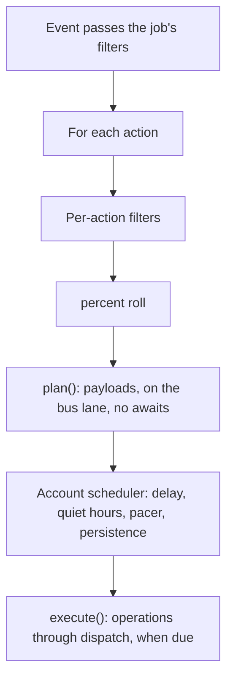

# Actions

The last stage of a gateway job: what it does with a message that passed its
filters. Every built-in action runs through the op layer (the same
operations the CLI calls), in process, for the job's account, so a job gets
the policy allow/deny list, the rate limiter, the flood-wait budget and the
self-origin events on the bus, exactly like a command typed by hand.

## How it works



An action is an `Action` subclass (`base.py`) registered with
`@register_action`. It is split in two because the halves happen at
different times, possibly in different processes:

* `plan(facts, params, chain, rng)` runs when the event arrives. It reads
  the message through `MessageFacts`, applies processors, picks the emoji,
  and returns plain payloads. It never awaits, so the bus lane is never held.
* `execute(items, runtime)` runs when the item is due and its pacer slot is
  open, possibly after a restart, from nothing but the persisted
  `PendingItem`. It calls operations through `runtime.op(...)`.

Class attributes tell the scheduler how to treat the kind: its expiry, whether
quiet hours hold it, which `on_takeover` modes cancel it, whether an album
gets one action, and how items coalesce (`batch_key`).

A plain async function registered with `@register_action` is still accepted.
It receives `(event, config, client, chain)` and runs at once, outside the
scheduler, as actions always did.

## Built-in actions

Every action also takes the shared knobs `delay`, `percent`, `presence`,
`on_takeover`, `dry_run` and `filters`; see `tlgr/gateway/README.md`.

### forward

```yaml
- forward: "@archive"
- forward:
    to: ["@clean_feed", "@archive"]
    drop_author: true
    processors: [strip_formatting]
```

| Key | Type | Description |
|-----|------|-------------|
| `to` | `str` or `list` | Destination chat(s); each is its own pending item |
| `drop_author` | `bool` | Hide the original author (native forward) |
| `processors` | `list` | Rewrite the text; turns the forward into a re-send |

Without processors: `message.forward` (`--no-author` with `drop_author`).
With processors the processed text is re-sent with `message.send`, or a photo
or document is re-sent with the processed caption (`media.upload
--from-message`); text keeps its formatting as markdown. A link preview is
regenerated from the text. Service messages, empty messages and
self-destructing media are skipped. Pacing: 1 per 1.5 s. Never expires, never
held by quiet hours, never cancelled by a takeover.

### reply

```yaml
- reply: "Away until Monday"
- reply: {text: "Got it", typing: true, delay: 1-3m, processors: [...]}
```

| Key | Type | Description |
|-----|------|-------------|
| `text` | `str` | The reply; processors apply to it |
| `typing` | `bool` | Show "typing..." first (default `true`) |

Typing lasts about 40 characters a second of the text, clamped to 2-15 s
(`chat.typing`), then `message.send` goes out as a reply to the message. The
reply queue is not held while typing: the item is re-queued for the moment
typing ends. No indicator in a broadcast channel. An album gets one reply.
Pacing: 1 per 1.5 s. Expires after 24 h.

### react

```yaml
- react: "👍"
- react: ["👍", "❤", "🔥"]        # one, uniformly at random, per message
- react: {"👍": 3, "🔥": 1}       # weighted
- react: {emoji: ["👍", "🔥"], big: false, percent: 60, delay: 30-300s}
- react: "custom:5368324170671202286"   # a custom (Premium) emoji
```

The job's choice replaces any reaction the account already had on the
message (`reaction.add --replace`). A chat that does not allow the emoji is
not checked first: the reaction is sent and REACTION_INVALID shows in the
action's `errors`. Knobs need the long form (a weighted mapping is all
emoji).

Reacting implies reading: before the reaction goes out the chat is read up
to that message, coalesced with any read already pending for the chat, so
the other side never sees a reaction on a message still shown unread. This
happens even if the job has no `read` action. An album gets one reaction, on
the message with the caption, else the first one (where Telegram Desktop and
Android attach album reactions). Pacing: 1 per 4 s, at most 300 an hour.
Expires after 24 h.

### read

```yaml
- read: {}
- read: true
- read: {delay: 10-90s, mentions: true, reactions: true}
```

Marks the chat read up to the triggering message, never further (never
`max_id=0`). `message.read` picks the RPC for the peer: `readHistory` for a
private chat or basic group, `channels.readHistory` for a channel or
supergroup, `readDiscussion` for a forum topic. Reads that are due together
for one chat go out as one call with the highest id. On top of `delay`, the
item waits about as long as reading the text takes (250 words a minute, plus
3 s for media, at most 60 s). `mentions` and `reactions` also clear those
badges. Pacing: 1 per 2 s. Never expires.

### view

```yaml
- view: {}
- view: {include_view_once: true}
```

In a broadcast channel: `message.view.get --increment` (getMessagesViews with
`increment=true`), one call per chat with every id that is due. In a private
chat or group: voice notes and round video notes are marked listened
(`message.read --contents`). View-once and self-destructing media is never
consumed unless `include_view_once: true`. A message with nothing to view
counts as `skipped`. `view` and `read` are independent. Pacing: 1 per 2 s.
Expires after 24 h.

## Writing an action

```python
from tlgr.actions import register_action
from tlgr.actions.base import Action, Outcome


@register_action("pin")
class Pin(Action):
    name = "pin"
    cancelled_by = frozenset({"cancel"})

    def parse(self, config):
        return {"notify": bool((config or {}).get("notify", False))}

    def plan(self, facts, params, chain, rng):
        return [{"notify": params["notify"]}]

    async def execute(self, items, rt):
        item = items[0]
        request = {"chat": str(item.chat_id), "msg_id": item.msg_id, **item.payload}
        await rt.op("message.pin", request)
        return Outcome()
```

Add a pacer rule for it to `DEFAULT_PACING` in `gateway/pacer.py` (the
scheduler runs one queue per entry there) and it is paced, persisted and
counted like the built-ins.
