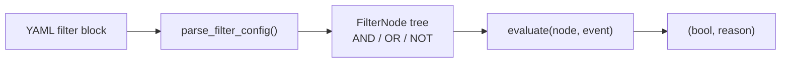
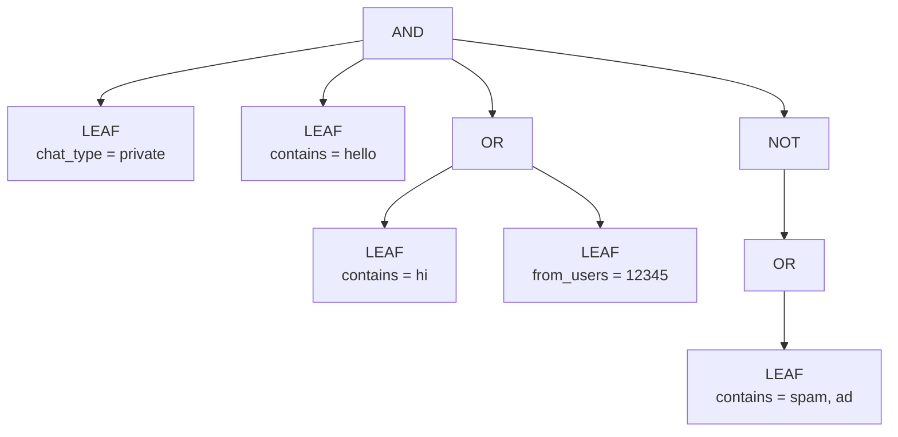

# Filters

Registry-based, composable event and message filters for the Gateway pipeline.

## How it works



Every filter is a plain function registered with `@register_filter`. Filters
receive an `Event` envelope and a config value (whatever was in the YAML) and
return `(matched: bool, reason: str)`.

## Built-in filters

### Event-context filters (`context.py`)

| Filter | Description | Value type |
|--------|-------------|------------|
| `chat_type` | private, group, supergroup, channel | `str` or `list[str]` |
| `chat_id` | Match by chat ID or @username | `int`, `str`, or `list` |
| `chat_title` | Regex match on chat title | `str` (pattern) |
| `is_incoming` | Incoming (not sent by you) | `bool` |
| `sender_is_bot` | Sender is a Telegram bot | `bool` |
| `sender_is_self` | Sent by your own account | `bool` |

### Content filters (`content.py`)

| Filter | Description | Value type |
|--------|-------------|------------|
| `contains` | ALL keywords must appear (case-insensitive) | `list[str]` |
| `contains_any` | At least ONE keyword must appear | `list[str]` |
| `excludes` | No listed keyword may appear | `list[str]` |
| `regex` | Text must match regex pattern | `str` (pattern) |
| `has_links` | Message has URL entities | `bool` |

### Message-attribute filters (`message.py`)

| Filter | Description | Value type |
|--------|-------------|------------|
| `types` | Message type whitelist | `list[str]` |
| `exclude_types` | Message type blacklist | `list[str]` |
| `has_media` | Has media attachment | `bool` |
| `is_reply` | Message is a reply | `bool` |
| `is_forward` | Message is forwarded | `bool` |

Valid message types: `text`, `photo`, `video`, `document`, `sticker`, `voice`,
`video_note`, `audio`, `poll`, `location`, `live_location`, `contact`, `game`,
`invoice`, `dice`, `gif`, `webpage`.

### Temporal filters (`temporal.py`)

| Filter | Description | Value type |
|--------|-------------|------------|
| `after` | Message date >= cutoff | `str` (date or relative: `7d`, `2w`, `1m`) |
| `before` | Message date <= cutoff | `str` |
| `time_of_day` | Within time range | `str` (`"HH:MM-HH:MM"`) |

### User filters (`user.py`)

| Filter | Description | Value type |
|--------|-------------|------------|
| `from_users` | Sender must be in list | `list[int]` |
| `exclude_users` | Sender must NOT be in list | `list[int]` |

## Composition

Top-level filter keys are AND'd together. Use `any_of` for OR and `none_of`
for NOT:

```yaml
filters:
  # These are AND'd:
  chat_type: private
  contains: [hello]

  # OR: at least one child must match
  any_of:
    - contains: [hi]
    - from_users: [12345]

  # NOT: none of the children may match
  none_of:
    - contains: [spam, ad]
```

`any_of` and `none_of` accept a list of filter-sets (dicts). Each child
filter-set can itself contain `any_of` / `none_of`, enabling arbitrary nesting.

### Composition internals

The YAML filter block is parsed into a tree of `FilterNode` objects:



`evaluate(node, event)` walks the tree recursively:
- **AND**: all children must pass
- **OR**: at least one child must pass
- **NOT**: the inner node must NOT pass
- **LEAF**: call the registered filter function

## Adding a custom filter

1. Create a function that takes `(event: Event, value: Any)` and returns
   `(bool, str)`.
2. Decorate it with `@register_filter("name")`.
3. Import it in `__init__.py` so it self-registers.

```python
# tlgr/filters/my_filter.py
from tlgr.filters import register_filter
from tlgr.gateway.event import Event


@register_filter("text_length")
def filter_text_length(event, value):
    if event.source != "telegram":
        return False, "requires telegram"
    text = event.raw.message.text or ""
    min_len = value.get("min", 0) if isinstance(value, dict) else int(value)
    if len(text) >= min_len:
        return True, "long enough"
    return False, f"text too short ({len(text)} < {min_len})"
```

Then import in `__init__.py`:

```python
from tlgr.filters import my_filter  # noqa: F401
```

Now usable in YAML:

```yaml
filters:
  text_length: 10
```
