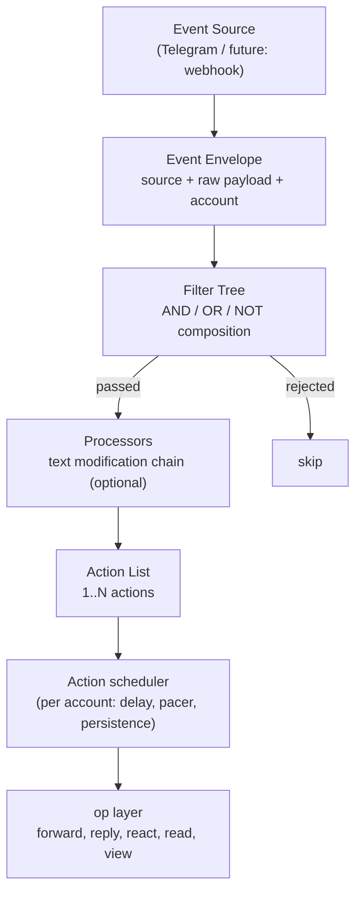
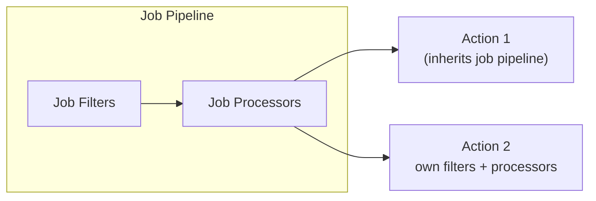
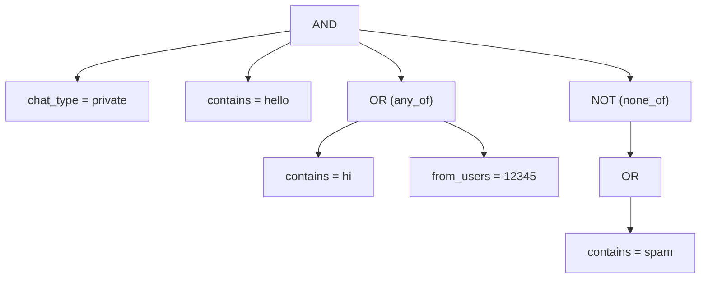
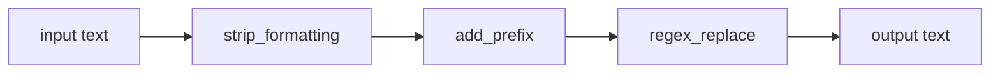
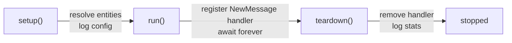

# Gateway

The Gateway is tlgr's generic event-driven pipeline engine. Each job is a declarative pipeline that reacts to incoming Telegram events -- no code required, just YAML.

## Pipeline



Each action in the list can override the job-level filters and processors:



## Event Envelope

Defined in `event.py`. Intentionally thin -- filters extract what they need from `raw` directly.

```python
@dataclass(slots=True)
class Event:
    source: str  # "telegram", "webhook", etc.
    raw: Any  # original Telethon event or webhook payload
    account: str  # which account received it
    timestamp: datetime
```

## Configuration

Jobs live in `~/.tlgr/jobs.yaml`:

```yaml
jobs:
  - name: my-job
    account: main
    enabled: true           # default: true
    filters:                # optional
      chat_type: private
    processors:             # optional, job-level
      - strip_formatting
    actions:
      - reply: "hello!"
      - forward:
          to: ["@archive"]
          processors: [add_prefix:prefix=[FWD]]  # overrides job-level
```

A DM job using the newer actions and knobs:

```yaml
jobs:
  - name: dm-ack
    account: Neo
    filters: {chat_type: private, sender_is_contact: true}
    presence: {mode: session, quiet_hours: "01:00-08:00"}
    on_takeover: cancel        # cancel | cancel_read | ignore
    actions:
      - read:  {delay: 10-90s}           # + reading time
      - view:  {delay: 15-120s}          # voice/round notes
      - react:
          emoji: ["👍", "❤", "🔥"]       # random; or {"👍": 3, "🔥": 1}
          percent: 60
          delay: 30-300s
      - reply:
          text: "Got it, will answer soon"
          filters: {chat_is_new: true}
          typing: true                   # default for reply
          delay: 1-3m
```

The file is validated strictly: an unknown key on a job or an action, a bad
duration, a percent outside 0-100 or an unknown presence mode is reported
with the job's name and the action's position (`tlgr job reload
--validate-only`, `tlgr config validate`, and `tlgr job add` refuses it). At
load, a broken job is skipped and logged while the other jobs still run; on
`job reload`, a job whose edit broke it keeps running in its last good form.

### Action syntax

Actions use concise syntax -- the action name is the key:

```yaml
# Simple: string value
- reply: "hello!"

# Complex: dict value with sub-keys
- forward:
    to: ["@dest1", "@dest2"]
    drop_author: true
    filters:
      has_media: true
    processors:
      - strip_formatting
```

## Filters

Registry-based, composable. Top-level keys are AND'd. `any_of` gives OR, `none_of` gives NOT. These can nest arbitrarily.



```yaml
filters:
  chat_type: private
  contains: [hello]
  any_of:
    - contains: [hi]
    - from_users: [12345]
  none_of:
    - contains: [spam]
```

### Built-in filters

#### Event context (`context.py`)

| Filter | Description | Value |
|--------|-------------|-------|
| `chat_type` | private, group, supergroup, channel | `str` or `list` |
| `chat_id` | Match by chat ID or @username | `int/str` or `list` |
| `chat_title` | Regex match on chat title | `str` (pattern) |
| `is_incoming` | Incoming vs outgoing | `bool` |
| `sender_is_bot` | Sender is a bot | `bool` |
| `sender_is_self` | Sent by yourself | `bool` |

#### Content (`content.py`)

| Filter | Description | Value |
|--------|-------------|-------|
| `contains` | All keywords must appear (case-insensitive) | `list[str]` |
| `contains_any` | At least one keyword | `list[str]` |
| `excludes` | No listed keyword may appear | `list[str]` |
| `regex` | Text must match pattern | `str` (pattern) |
| `has_links` | Has URL entities | `bool` |

#### Message attributes (`message.py`)

| Filter | Description | Value |
|--------|-------------|-------|
| `types` | Message type whitelist | `list[str]` |
| `exclude_types` | Message type blacklist | `list[str]` |
| `has_media` | Has media attachment | `bool` |
| `is_reply` | Is a reply | `bool` |
| `is_forward` | Is forwarded | `bool` |

Valid types: `text`, `photo`, `video`, `document`, `sticker`, `voice`, `video_note`, `audio`, `poll`, `location`, `live_location`, `contact`, `game`, `invoice`, `dice`, `gif`, `webpage`.

#### Temporal (`temporal.py`)

| Filter | Description | Value |
|--------|-------------|-------|
| `after` | Message date >= cutoff | `str` (date or relative: `7d`, `2w`, `1m`) |
| `before` | Message date <= cutoff | `str` |
| `time_of_day` | Within time range | `str` (`"HH:MM-HH:MM"`) |

#### User (`user.py`)

| Filter | Description | Value |
|--------|-------------|-------|
| `from_users` | Sender must be in list | `list[int]` |
| `exclude_users` | Sender must NOT be in list | `list[int]` |

#### Dialog (`dialog.py`)

| Filter | Description | Value |
|--------|-------------|-------|
| `sender_is_contact` | Sender is in the account's contacts | `bool` |
| `chat_is_new` | First message ever in a private chat (one history probe per chat, cached) | `bool` |

### Adding a custom filter

```python
# tlgr/filters/my_filter.py
from tlgr.filters import register_filter


@register_filter("text_length")
def filter_text_length(event, value):
    if event.source != "telegram":
        return False, "requires telegram"
    text = event.raw.message.text or ""
    if len(text) >= int(value):
        return True, "long enough"
    return False, f"text too short ({len(text)})"
```

Import in `tlgr/filters/__init__.py`, then use in YAML:

```yaml
filters:
  text_length: 10
```

## Processors

Text modification functions applied in sequence. Per-action processors override job-level.



### Built-in processors

| Processor | Description | Config |
|-----------|-------------|--------|
| `replace_mentions` | Replace @mentions | `replacement`, `pattern` |
| `remove_links` | Remove URLs | `replacement` |
| `remove_hashtags` | Remove #hashtags | `replacement` |
| `strip_formatting` | Normalize whitespace | -- |
| `add_prefix` | Prepend text | `prefix` |
| `add_suffix` | Append text | `suffix` |
| `regex_replace` | Custom regex | `pattern`, `replacement`, `flags` |

Config formats in YAML:

```yaml
processors:
  - strip_formatting                      # name only
  - add_prefix:prefix=[NEWS]              # inline config
  - type: regex                           # dict form
    pattern: "sponsor"
    replacement: ""
    flags: i
```

### Adding a custom processor

```python
from tlgr.processors import register_processor


@register_processor("uppercase")
def uppercase(text, config=None):
    return text.upper()
```

## Actions

Five built-in actions: `forward`, `reply`, `react`, `read` and `view`. Every
one runs through the op layer (the same code paths the CLI uses), in process,
for the job's account, so a job inherits the policy allow/deny list, the rate
limiter, the flood-wait budget and the self-origin events on the bus. The
reference for each action and its keys is `tlgr/actions/README.md`.

```yaml
actions:
  - forward: {to: ["@archive"], drop_author: true}
  - reply: {text: "Got it", typing: true, delay: 1-3m}
  - react: {emoji: ["👍", "❤", "🔥"], percent: 60, delay: 30-300s}
  - read: {delay: 10-90s, mentions: true}
  - view: {delay: 15-120s}
```

### Knobs every action takes

Set on an action, or on the job as a default for all its actions (the
action's value wins). The defaults keep a job doing exactly what it did
before the knobs existed, apart from pacing.

| Knob | Default | Meaning |
|------|---------|---------|
| `delay` | none | Uniform random delay, measured from when the daemon received the event (not the message date). `10-90s`, `1-3m`, `5s`, `500ms`. |
| `percent` | `100` | Chance (0-100) of acting on a given message, rolled per message per action. An album is one roll. A roll-out counts as `skipped`. |
| `presence` | `leave` | `leave`, `blip`, `session`, or `{mode: ..., quiet_hours: "01:00-08:00"}`. See below. |
| `on_takeover` | `cancel` | `cancel`, `cancel_read` or `ignore`. See below. |
| `dry_run` | `false` | Run filters, rolls and scheduling, log what would be done and count it, never call Telegram. |
| `filters` | none | Per-action filters, AND'd with the job's. |

A delay never blocks the bus: the job's handler queues the action and
returns, and the account's scheduler runs it when it is due. Actions of one
job are scheduled independently, so a forward can go at once while a
reaction on the same message waits two minutes.

### Pacing

One pacer queue per (account, action kind), shared by every job on the
account, so a backlog of reactions never delays a forward. `every` is a
floor: jitter only lengthens the gap, drawing it from `[every, 1.5 x every]`.
A backlog (hundreds of messages replayed by catch-up) is acted on, never
skipped, at the configured rate.

```yaml
pacing:                    # optional; these are the defaults
  Neo:                     # account alias
    react:   {every: 4s, per_hour: 300}
    read:    {every: 2s}
    view:    {every: 2s}
    forward: {every: 1.5s}
    reply:   {every: 1.5s}
    expire:  {react: 24h, view: 24h, reply: 24h}   # read and forward: never
```

An absent `per_hour` keeps the default cap; `per_hour: null` lifts it.
`expire` takes a duration or `never`; an action still pending that long
after its event arrived is dropped and counted as `expired`.

Failures: a FLOOD_WAIT reschedules the item after the wait and doubles that
queue's spacing (up to 8x, recovering after ten quiet minutes); a transient
failure (network, server) is retried after about 5 s, 30 s and 2 min, and a
forward or read (which never expire) then every ten minutes for about an
hour and a half; any
other error (REACTION_INVALID, MESSAGE_ID_INVALID, CHAT_WRITE_FORBIDDEN, a
policy refusal) is counted under the action's `errors` and not retried.

### Persistence

Pending actions (delayed, or waiting for their pacer slot) are kept in
`~/.tlgr/accounts/<alias>/pending.json` (mode 0600, written atomically, at
most 10 000 items) and survive a restart or a crash. At boot, once the jobs
are running, each resumes at its original due time; an overdue one goes
through the pacer. Items of a job that no longer exists are dropped. The
file also remembers recently finished items, so an update replayed after a
crash is not acted on twice.

### Presence

Telethon never sends `account.updateStatus`, so tlgr reads as offline while
it reacts and replies. `presence` changes that, per account:

* `leave` (default): never touch presence.
* `blip`: online just before the action, offline about 5 s after.
  Overlapping blips merge.
* `session`: online while any action of the account is running or due within
  a few seconds, offline about 5 s after the last.
* `quiet_hours: "01:00-08:00"`: read, view, react and reply (not forward) are
  held until the window ends, then released through the pacer, spread over
  five minutes. The window is in `[defaults] timezone`, or local time.

Two jobs asking for different modes on one account: the most online request
wins while its actions run. A `leave` action never turns presence on, and
never ends an online stretch a `blip` or `session` action started. If the
account-level `[presence] mode` is not `off`, the daemon already owns the
account's status and job presence does nothing.

### Manual takeover

When you act in a chat yourself from another device (read it elsewhere, or
send a message there), pending actions for messages up to that point are
dropped and counted as `superseded`, according to `on_takeover`:

| `on_takeover` | Drops |
|---------------|-------|
| `cancel` (default) | read, view, react and reply |
| `cancel_read` | read and view only |
| `ignore` | nothing |

Forwards are never cancelled. Reads and sends tlgr made itself are told apart
by the message ids it recorded, so its own read receipt does not count as a
takeover.

### Inspecting and controlling

```bash
tlgr job list                    # per-job and per-action counters
tlgr job get dm-ack              # one job's pipeline and counters
tlgr job queue                   # pending actions (same as: tlgr job queue list)
tlgr job queue list --job dm-ack --chat @alice
tlgr job queue cancel 3f2a9c1b7e # by id
tlgr job queue cancel --chat @alice --yes
tlgr job queue cancel --all --yes
```

Counters per action: `done`, `skipped` (percent roll, nothing to view, album
sibling), `superseded` (takeover or cancel), `expired`, `pending`, `errors`
(with `last_error`). `tlgr daemon status` also shows each account's queue.

### Adding a custom action

A built-in action is an `Action` subclass with a `plan` (runs on the bus
lane, returns payloads) and an `execute` (runs when due, calls operations
through the runtime). See `tlgr/actions/README.md`. A plain async function
registered with `@register_action` still works: it runs at once, outside the
scheduler, with `(event, config, client, chain)`.

## Engine lifecycle



The `Gateway` class extends `BaseJob`, integrating with the daemon's `JobRunner` lifecycle. On each incoming event:

1. Wrap in `Event` envelope
2. Evaluate the filter tree (awaiting the filters that ask Telegram)
3. If passed, iterate over actions
4. For each action: check per-action filters, roll `percent`, plan the
   payloads (processors applied, emoji picked) and queue them on the
   account's scheduler, which runs them through the op layer when due

## Managing jobs

```bash
tlgr job add --name dm --action 'read:delay=10-90s' --action 'react:emoji=👍'
tlgr job add --edit    # open jobs.yaml in $EDITOR
tlgr job list          # show jobs, status and counters
tlgr job queue         # pending actions
tlgr job enable <name>
tlgr job disable <name> # also drops what the job had queued
tlgr job remove <name>
tlgr job reload --validate-only
tlgr config validate   # check YAML, knobs, pacing and names against registries
```

No code changes needed for new jobs -- the Gateway engine handles any combination of registered filters, processors, and actions.
